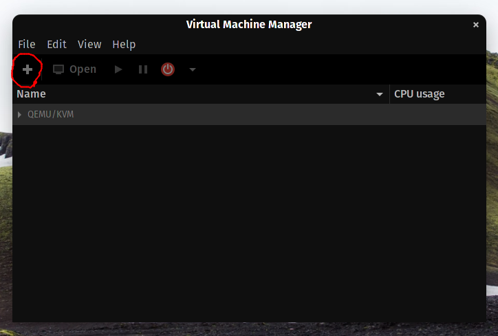
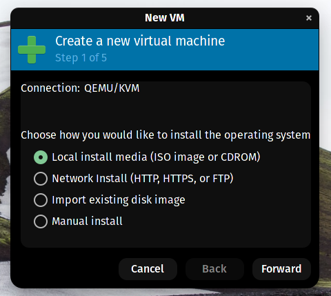
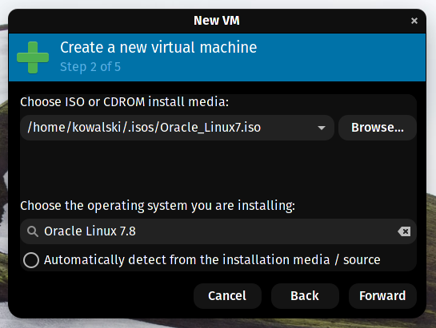
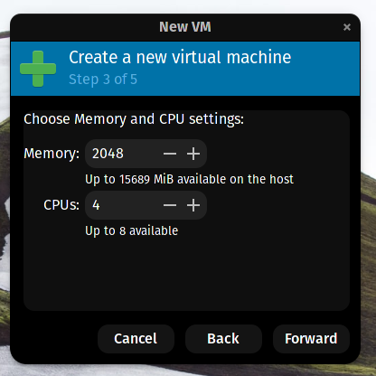
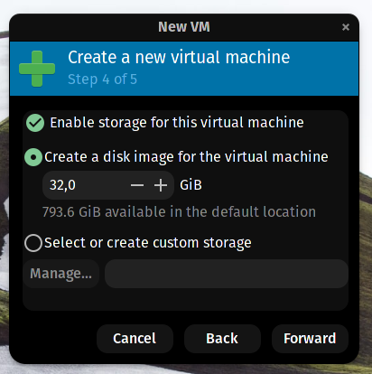
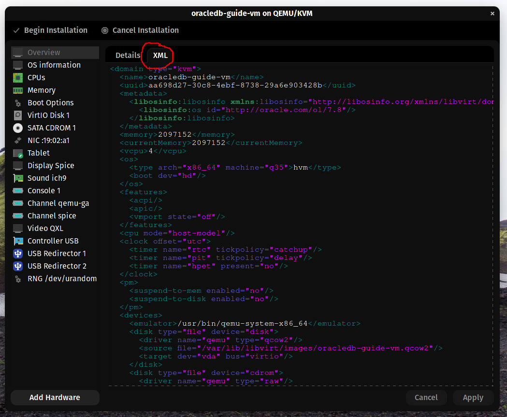

README

# ora18c_vm_arch
My experience installing oracle database 18c XE on RHEL in a vm on arch linux, and connecting to it using sqlDeveloper on the host

---
## Prerequisites
For this tutorial, I am assuming basic linux command knowledge. As for choice of distro, I completed this process using Arch Linux, but you should be able to follow along using your preferred distro. You will also need an account at oracle.com

### Programs I used to set things up
On the **RHEL-guest**:
- yum
- openssh-server
- wget
- NetworkManager

On the **arch-host**:
- pacman
- openssh

---
## Before installation
Make sure you have enabled virtualisation in your BIOS, either intel Hyper-V or the AMD equivalent, this is needed to be able to run virtual machines on your computer.
**If your hardware does not support virtualisation, you cannot follow this guide**

---
## Installing virt-manager
To install virt-manager and its dependencies, run the following command
`sudo pacman -Syu virt-manager virt-viewer dnsmasq vde2 bridge-utils ebtables iptables`
This will install all the stuff you need to use virt-manager for our purposes.
Once the installation is finished, proceed to 'creating the RHEL vm'

---
## Creating the RHEL vm
### virt-manager GUI
At this point, you are going to need to head over to [oracle.com](https://edelivery.oracle.com/osdc/faces/SoftwareDelivery) and get yourself a version of Oracle Linux. I chose RHEL 7.8 for my setup.

**Before proceeding, make sure in the settings of virt-manager you have enabled xml-editing**

Creating a vm in virt-manager is easy, just follow the steps the GUI gives you.
- Click the big plus button.

- This screen will popup, choose for local install media and continue.

- Choose the RHEL .iso you downloaded and specify the specific version if it is not automatically detected.

- Specify how much RAM and CPU you want to assign to the vm, for my use case, 2Gb RAM and 4 vCPU cores is plenty of power.

- Make sure storage is enabled for the vm, and assign it a reasonable amount of space, 20Gb is an unenforced minimum.

- Name your vm and check the box `Customize configuration before install` 
You will land on a new window, detailing all the devices and configurations related to the vm you are about to create. We are here to add a memballoon device, this device dramatically reduces the amount of ram a vm needs during runtime. It dynamically scales with usage. This way, your vm isn't constantly occupying all the RAM you have allocated to it.
- Switch to the XML view and scroll down to the end of the `<devices>` section.

- Place your cursor above `</devices>` and add the following line:
`<memballoon model='virtio'/>`. If this line is already present, don't duplicate it.
- After doing so, go ahead and click `Begin installation`
- A new screen will popup with the screen of the virtual machine. Follow the steps on screen to proceed with the installation, I won't be covering this as it is really straightforward. After having completed the setup process, go ahead and reboot the vm to proceed.
- login to the shell with the username and password you setup during the GUI installation.
- run these commands in order to install ssh: 
	-	`su -` this changes the shell to a root shell, in which you can install software
	- `yum install openssh-server` to install the ssh package
	- `exit` to exit the root shell
	- shutdown the vm by running `shutdown now`
- Now that the GUI installation is complete, open the vm's configuration by right clicking on it and choosing `open` and navigating to the `info` symbol
- Remove all the devices listed below as they are not needed for further configuration of the server
	- SATA CDROM (your .iso)
	- Tablet
	- Display Spice
	- Sound ich9
	- Serial 1
	- Channel qemu-ga
	- Channel spice
	- Video QXL
	- Controller 
	- all USB redirectors
	- RNG generator (if present)
- Reboot the vm. This time there shouldn't be a window popping up with the shell. Instead we will be logging in to the vm through ssh
- Open a new terminal session and run `ssh [vm-username]@[vm-lan-ip]`, you can find the lan-ip of the vm in the GUI configuration of virt-manager. There should be a NIC with a lan-ip in there.
- At this point you should be connected to the vm through a ssh connection. If everything is working and you have solved all the errors you have come across along the way, it is time to proceed to the next step: `Setting up networking`.

---
## Setting up networking
### virt-manager networking
### nmcli config

---
## Installing oracle 18c XE

---
## Installing sqldeveloper
### sqldeveloper.desktop

---
## Connection
### tnsnames.ora
### listener.ora

---
